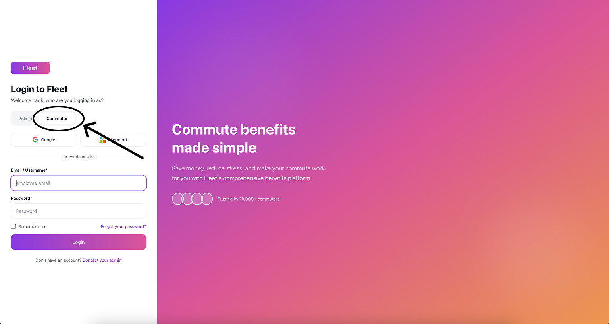
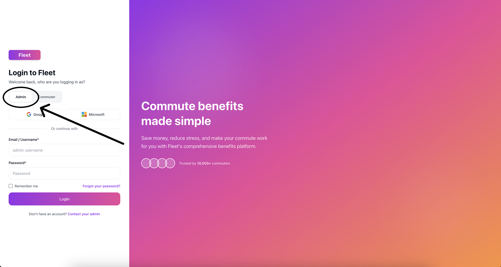

# Fleet Commuter Game Demo

An end-to-end prototype that turns commuter benefits into a game — helping employees save money, discover better routes, and turn their daily commute into something they actually look forward to.

## Live demo

Come check out the live prototype at  
[https://fleet-demo.elegora.ca](https://fleet-demo.elegora.ca)

---

## Insight that drove this approach

**A brief explanation (3–4 sentences) about the insight that drove your approach:**

My approach centered on making Fleet as valuable and engaging as possible for employees, helping them save money through pre-tax transit benefits, explore better commuting routes, and turn daily travel into a fun, social experience with coworkers. By gamifying participation and showing tangible savings, Fleet becomes something employees are excited to share, creating organic demand across workplaces. This employee-driven enthusiasm can then be leveraged by companies to boost morale, strengthen team cohesion, and reduce costs — all through a benefit their teams genuinely enjoy.

---

## What this prototype demonstrates

### Employee experience (commuter side)

- Log in as an employee and see multiple commute options visualized on an interactive map.  
- Tap through different routes to compare options for the same commute.  
- Confirm a commute to:
  - Earn points
  - Track savings from pre-tax benefits
  - Move closer to shared office rewards
- View a **Rewards** page that makes progress and savings feel concrete and motivating.  
- Explore a **Statistics** page that shows how daily choices add up over time.

### HR / Admin experience (employer side)

- Log in as HR to see employees participating in Fleet.  
- Group employees into **reward pools**, so incentives feel social and team-based.  
- Open a **Reports** view to see:
  - Total money saved through pre-tax commuting
  - CO₂ reduced
  - How far the office has progressed toward different rewards

### Technical story

- Full-stack demo built with Fleet’s core patterns:  
  - **React + Redux + RTK Query** on the front end  
  - **Django + Postgres** on the back end  
- Real API calls powering key flows:
  - Logging in as employee or HR
  - Loading commute options
  - Starting/confirming sessions
  - Tracking points and savings
  - Generating office-level reports
- Deployed as an interview-ready prototype that’s interactive, data-backed, and easy to explore.

---

## Notes on hosting & performance

The prototype uses a realistic cloud setup instead of local mocks:

- The frontend is hosted on **Vercel**.
- The backend (Django API) and **Postgres** database are hosted on **Railway** on a free trial tier.

Because of the free-tier hosting:

- The **first request after inactivity** can take a few seconds while Railway spins up the backend.
- Occasionally, if the tab has been idle for a long time or the API disconnects, simply:
  - **Log out**, then  
  - **Log back in**  
  and everything should reconnect and behave normally.

Once the services are awake, the experience is designed to feel smooth and responsive.

---

## How to explore the prototype

### 1. Employee (commuter) journey

1. Open the landing page and select the **Commuter** option.

 

2. Sign in with:

   - `username: employee_demo`
   - `password: password123`

3. On the main commute screen:
   - Tap on the different **commute options** to preview possible routes on the map.
   - Compare what each option would mean for your commute.

   

    
   

4. **Confirm** one of the commute options:
   - See points awarded for completing that commute.
   - See how much you’ve saved using pre-tax transit benefits for that choice.

5. Go to the **Rewards** page:
   - View how far you are from the next reward based on your current points.
   - Get a sense of how the game layer makes the benefit more engaging.

   

    
   

6. Visit the **Statistics** page:
   - Check the running totals for savings and commute activity.

   

    
  

7. Pretend it’s a **new day**:
   - Confirm a different commute option.
   - Go back to the **Rewards** page to see how much closer you are to the next reward after another day of participation.

---

### 2. HR / Admin journey

1. Log out from the commuter side to return to the landing page.
2. Select the **Admin** option.

  

3. Sign in with:

   - `username: hr_demo`
   - `password: password123`

4. (If the backend has gone idle, give Railway a few seconds to wake the service.)

5. On the **Employees** page:
   - See employees enrolled in Fleet.
   - Group them into pooled rewards to encourage team-based participation.

   

    
   

6. Open the **Reports** page:
   - Review the office-level overview:
     - Total **money saved** through pre-tax commuting  
     - Total **CO₂ reduced** by the office  
     - The **reward milestones** that have been reached so far  
    

     
    

This shows how the same underlying data model supports both sides:  
a fun, motivating experience for employees and a clear, high-level view for HR.

---

## Tech stack

### Frontend

- **React**
- **Redux Toolkit** for application state management
- **RTK Query** for data fetching, caching, and API integration
- **CSS + Tailwind CSS** for styling and layout
- Hosted on **Vercel**
- Integrated with a custom subdomain on **`elegora.ca`**, with DNS and CNAME configured via **Cloudflare**

### Backend

- **Django** (Python)
- **Django REST Framework** for API endpoints
- **Postgres** as the primary database
- Backend server and database both hosted on **Railway**

The frontend and backend communicate via JSON APIs, with RTK Query handling most of the client-side data loading and caching logic.

---

## Architecture overview

At a high level:

- The **frontend** handles:
  - Landing page and role selection (commuter vs admin)
  - Commuter experience: route options, map views, confirmations, rewards, stats
  - Admin experience: employee lists, pools, and reports
  - Session handling and navigation

- The **backend** handles:
  - Authentication for demo users (`employee_demo`, `hr_demo`)
  - Commute sessions (start/finish, points, and savings)
  - Employee and office data
  - Aggregated statistics for money saved, CO₂ reduced, and rewards reached

---